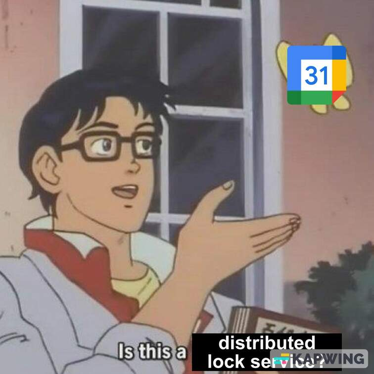

#ai-slop #to-anki

Distributed synchronization primitives — for coordinating state across processes, machines, or network partitions.

**The core shift from single-machine:** you no longer have shared memory or a single kernel as authority. Messages can be delayed, nodes can crash mid-operation, and clocks differ. So "perfect lock semantics" is replaced with *leases, consensus, idempotent writes, and conflict detection*.

Related: [[synchronization]], [[Concurrency]]

---

## Q: Lease (time-bounded distributed lock)

### A:

* Main usage: a lock with an expiration time — the holder must renew before it expires, or ownership lapses automatically. The default answer to "how do I do a distributed mutex?"
* Why leases over plain locks: if the holder crashes or goes offline, the resource isn't stuck forever — it becomes available again at `expiry`.
* Fundamental operations:
  * `acquire(resource, ttl)` — returns a token if unclaimed
  * `renew(token, ttl)` — extend before expiry (heartbeat)
  * `release(token)` — early return
  * `check_owner(resource, now)` — who holds it?
* Implementation shape: a single record `{owner, lease_expiry, revision}` in a shared store (Redis, database, etcd)
* Calendar analogy: a lease is a calendar event — `acquire` = create event, `renew` = extend, `release` = delete. [Breaks down](https://en.wikipedia.org/wiki/Distributed_lock_manager) when you need strict atomicity or fencing tokens.
* Gotcha: clock skew means "expiry" is approximate. Real systems add a safety buffer (e.g., Redis's [Redlock](https://redis.io/docs/latest/develop/use/patterns/distributed-locks/) uses `validity_time = lease_duration - clock_drift_estimate`).

---

## Q: Distributed Lock (lock server / coordination service)

### A:

* Main usage: network-visible mutual exclusion backed by a highly-available authority that all clients trust.
* How it differs from a lease: a distributed lock *is* a lease — but the term emphasizes the infrastructure (a dedicated service) rather than the data model.
* Examples:
  * [Apache ZooKeeper](https://zookeeper.apache.org/doc/r3.9.1/recipes.html#sc_recipes_Locks) — ephemeral sequential znodes; node disappears = lock released
  * [etcd](https://etcd.io/docs/v3.5/dev-guide/interacting_v3/#lease) — lease TTLs with `LeaseGrant` / `LeaseKeepAlive`
  * [Redis Redlock](https://redis.io/docs/latest/develop/use/patterns/distributed-locks/) — acquire lock on majority of N independent nodes; contested in literature (see [Martin Kleppmann's critique](https://martin.kleppmann.com/2016/02/08/how-to-do-distributed-locking.html))
  * [Chubby](https://research.google/pubs/the-chubby-lock-service-for-loosely-coupled-distributed-systems/) (Google) — Paxos-backed lock service; inspired ZooKeeper
* Gotcha: a distributed lock without a [fencing token](https://martin.kleppmann.com/2016/02/08/how-to-do-distributed-locking.html) is not safe — a slow client can still act after its lease expires.

---

## Q: Fencing Token

### A:

* Main usage: a monotonically-increasing number included in every write to a protected resource, so the resource server can reject stale writes from slow or GC-paused clients whose lease already expired.
* How it works: the lock service increments a counter with each grant. Client includes `{token: 42}` in its writes. The storage layer rejects any write with a token ≤ the last accepted token.
* Why needed: even with leases, a client can be paused (GC, VM suspend) and wake up believing it still holds the lock. Without a fencing token, it corrupts shared state.
* Coined by Martin Kleppmann in [How to do distributed locking](https://martin.kleppmann.com/2016/02/08/how-to-do-distributed-locking.html); etcd's `revision` number serves this role naturally.

---

## Q: Compare-and-Swap / Conditional Write (optimistic concurrency)

### A:

* Main usage: update shared state *only if it hasn't changed since last read* — the distributed equivalent of CAS. Avoids the need for a lock at all in low-contention cases.
* Also called: optimistic locking, optimistic concurrency control (OCC)
* Pattern: read current version → compute new value → write `IF version = N THEN set value, increment version`
* Implementations:
  * SQL: `UPDATE … WHERE revision = :old_rev` (check `rowcount = 1`)
  * DynamoDB: [`ConditionExpression`](https://docs.aws.amazon.com/amazondynamodb/latest/developerguide/Expressions.OperatorsAndFunctions.html)
  * etcd: [`version` field in `Txn`](https://etcd.io/docs/v3.5/learning/api/#transaction)
  * Redis: [`WATCH` + `MULTI`/`EXEC`](https://redis.io/docs/latest/develop/interact/transactions/)
  * HTTP: `ETag` / `If-Match` header (see below)
* Gotcha: high-contention workloads thrash with retry storms. Use a queue or lock instead.

---

## Q: ETag / `If-Match` (HTTP conditional writes)

### A:

* Main usage: [HTTP-level optimistic concurrency](https://developer.mozilla.org/en-US/docs/Web/HTTP/Reference/Headers/ETag) — the server sends `ETag: "v5"` with a resource; the client includes `If-Match: "v5"` on `PUT`/`PATCH`; the server rejects with `412 Precondition Failed` if the resource changed in the meantime.
* This is the web-native form of compare-and-swap.
* Canonical use cases: REST APIs editing shared documents, object storage (S3's `If-Match` on `PutObject`), Git's push rejection when remote has diverged
* **Thread affinity: N/A** — client supplies its own token.

---

## Q: SQL Transaction (ACID)

### A:

* Main usage: group multiple reads/writes into an atomic unit with defined isolation guarantees. The database engine manages concurrency internally.
* Key properties ([ACID](https://en.wikipedia.org/wiki/ACID)):
  * **Atomicity** — all-or-nothing commit
  * **Consistency** — integrity constraints hold
  * **Isolation** — concurrent transactions don't see each other's partial state (degree depends on isolation level)
  * **Durability** — committed data survives crashes
* Isolation levels (weakest → strongest): `READ UNCOMMITTED` → `READ COMMITTED` → `REPEATABLE READ` → `SERIALIZABLE`
* Internal mechanisms: row-level locks (pessimistic), MVCC (optimistic — Postgres, MySQL InnoDB), or [serializable snapshot isolation](https://en.wikipedia.org/wiki/Snapshot_isolation#Serializable_Snapshot_Isolation)
* Gotcha: serializable is rarely the default. Postgres and MySQL default to `READ COMMITTED` / `REPEATABLE READ` — phantom reads are still possible unless you explicitly use `SERIALIZABLE`.

---

## Q: Two-Phase Locking (2PL)

### A:

* Main usage: the classical database protocol that achieves serializability — acquire all locks before releasing any. Prevents interleaving that would produce non-serializable histories.
* Two phases: *growing* (only acquire) then *shrinking* (only release).
* Not typically written by application developers — the DB engine uses this internally for pessimistic isolation.
* Distributed variant: [Distributed 2PL](https://en.wikipedia.org/wiki/Two-phase_locking) coordinates lock managers across shards; requires a lock manager per node.
* Gotcha: prone to deadlock; needs deadlock detection or timeouts.

---

## Q: Two-Phase Commit (2PC)

### A:

* Main usage: atomically commit (or abort) a transaction that spans multiple independent databases/services. A coordinator asks all participants to "prepare" (durable promise to commit), then "commit" once all agree.
* Phases: *prepare* (all participants vote yes/no) → *commit* or *abort*
* Problem: [blocking on coordinator failure](https://en.wikipedia.org/wiki/Two-phase_commit_protocol#Disadvantages) — if the coordinator crashes after "prepare" but before "commit," participants are stuck holding locks.
* Examples: `XA` transactions (JDBC, MySQL, Postgres), AWS DynamoDB Transactions internally
* Gotcha: 2PC is often called "the algorithm everyone knows not to use but uses anyway." Consider [Sagas](https://microservices.io/patterns/data/saga.html) for long-running workflows.

---

## Q: Saga Pattern (compensating transactions)

### A:

* Main usage: manage a long-running multi-step workflow across microservices without a distributed lock — each step has a compensating action (undo) if a later step fails.
* Two coordination styles:
  * **Choreography** — services emit events; each service reacts and emits the next
  * **Orchestration** — a central saga orchestrator drives the steps
* Examples: order fulfillment (reserve inventory → charge card → ship; if charge fails, release inventory), airline booking across systems
* When to prefer over 2PC: latency-sensitive, loosely-coupled services, or when holding DB locks for seconds is unacceptable
* Gotcha: compensating actions must be idempotent and always succeed — you can't "un-send an email."

---

## Q: Consensus (Paxos / Raft)

### A:

* Main usage: a group of nodes agrees on a single value (or ordered log of values) even if some nodes fail or messages are delayed. The correctness foundation for distributed databases, leader election, and lock services.
* Algorithms:
  * [Paxos](https://en.wikipedia.org/wiki/Paxos_(computer_science)) — original (Lamport 1989); notoriously hard to implement correctly
  * [Raft](https://raft.github.io/) — designed for understandability; used by etcd, CockroachDB, TiKV
  * [Zab](https://zookeeper.apache.org/doc/r3.9.1/zookeeperInternals.html#sc_atomicBroadcast) — ZooKeeper's variant
* Guarantee: safety (no two nodes commit conflicting values) holds as long as a quorum (`floor(N/2)+1`) is reachable. Availability requires a quorum.
* Not typically implemented by application developers — used *within* etcd, CockroachDB, etc. Know it exists and what it guarantees.

---

## Q: Leader Election

### A:

* Main usage: select one node among peers to be the single coordinator for a resource or decision stream. Eliminates split-brain (two nodes both acting as leader).
* Common approach: use a consensus service (ZooKeeper, etcd) to run election — first to create an ephemeral node / claim a key wins; others watch for leadership change.
* Lease-based variant: leader holds a lease; followers monitor expiry. If lease lapses, re-election runs.
* Used inside: Kafka controller election, Kubernetes controller-manager, database primary failover
* Gotcha: leader can be elected but cut off from part of the cluster ([split-brain](https://en.wikipedia.org/wiki/Split-brain_(computing))). Quorum membership must be well-defined.

---

## Q: Version Vector / Vector Clock

### A:

* Main usage: track causality and detect conflicts when multiple nodes independently update the same data without a central lock.
* Each node increments its own component on every write: `{A:3, B:1, C:2}`. Merging two vectors detects whether one write happened-before the other, or they are concurrent (conflict).
* Used in: [Amazon Dynamo](https://www.allthingsdistributed.com/files/amazon-dynamo-sosp2007.pdf) (shopping cart), CRDTs, Git (commit DAG is effectively a vector clock)
* Gotcha: vector clocks grow unbounded with many clients; Dynamo used [dotted version vectors](https://riak.com/posts/technical/vector-clocks-revisited/) to bound this.

---

## Q: CRDT (Conflict-free Replicated Data Type)

### A:

* Main usage: a data structure designed so that concurrent updates from any number of nodes *always* merge without conflict — no locks, no coordination required for updates, eventual consistency is guaranteed mathematically.
* Types:
  * **G-Counter** (grow-only counter): merge = max per node
  * **LWW-Register** (last-write-wins): merge by timestamp
  * **OR-Set** (observed-remove set): add/remove without conflicts
  * **RGA / LSEQ** (sequences): collaborative text editing (used in [Yjs](https://yjs.dev/), Automerge)
* Trade-off: strong eventual consistency, not strict consistency. Not suitable when you need "exactly one winner" semantics.
* Examples: Redis [`HyperLogLog`](https://redis.io/docs/latest/develop/data-types/probabilistic/hyperloglogs/), [Riak](https://riak.com/), [Figma](https://www.figma.com/blog/how-figmas-multiplayer-technology-works/) multiplayer

---

## Q: Idempotency Key

### A:

* Main usage: make a non-idempotent operation (charge a card, send an email) safe to retry — the client generates a unique key per logical operation; the server deduplicates by key and returns the cached result.
* Pattern: `POST /charges {idempotency_key: "uuid-abc", amount: 50}` — second identical request returns the *same* response as the first without re-charging.
* Used by: [Stripe API](https://docs.stripe.com/api/idempotent_requests), payment processors, exactly-once message delivery
* Storage: server stores `{key → response}` in a durable store with a TTL
* Gotcha: the idempotency guarantee only covers *identical* requests with the same key. A different body with the same key typically returns an error (not a new charge).

---

## Q: Message Queue with At-Least-Once / Exactly-Once Delivery

### A:

* Main usage: decouple producers and consumers; the queue persists messages and retries on failure. Delivery semantics determine the synchronization guarantee.
* Delivery semantics:
  * **At-most-once** — fast, may lose messages (fire and forget)
  * **At-least-once** — retries on failure; consumer must be idempotent to tolerate duplicates
  * **Exactly-once** — strongest; implemented via transactional producers + idempotent consumers or two-phase delivery (**[Kafka transactions](https://www.confluent.io/blog/transactions-apache-kafka/)**, SQS FIFO + dedup ID)
* Examples: [SQS](https://aws.amazon.com/sqs/), [Kafka](https://kafka.apache.org/), [RabbitMQ](https://www.rabbitmq.com/)
* Gotcha: "exactly-once" across a queue + external side effects (e.g., charging a card) still requires idempotency keys on the consumer side — the queue's guarantee only covers its own delivery counter.

---

## Q: Distributed Semaphore / Rate Limiter

### A:

* Main usage: limit the number of concurrent workers across machines (connection pools, API quotas, job slots).
* Implementations:
  * Redis [`INCR`](https://redis.io/docs/latest/commands/incr/) + `EXPIRE` — token bucket / sliding window
  * Redis `SET NX` with TTL per slot — counting semaphore approximation
  * Dedicated services: [Redis Cell](https://github.com/nicowillis/redis-cell), [Envoy rate limiting](https://www.envoyproxy.io/docs/envoy/latest/intro/arch_overview/other_features/global_rate_limiting)
* Not as strong as a true semaphore: Redis key-expiry is not atomic with the work; network failures can double-count.
* Gotcha: a Redis-based semaphore is not fault-tolerant — if the Redis primary fails before replication, count can reset. Use Redlock or etcd for stricter guarantees.

---

## Quick mental grouping

* **Mutual exclusion over time**: Lease, Distributed lock, Fencing token
* **Atomic conditional updates**: Compare-and-swap / conditional write, ETag / `If-Match`
* **Multi-step atomicity**: SQL transaction (ACID), Two-phase commit (2PC), Saga
* **Agreement among nodes**: Consensus (Paxos/Raft), Leader election
* **Conflict-free concurrent updates**: CRDT, Version vector
* **Retry safety**: Idempotency key, At-least-once + idempotent consumer
* **Resource pooling across machines**: Distributed semaphore / rate limiter
